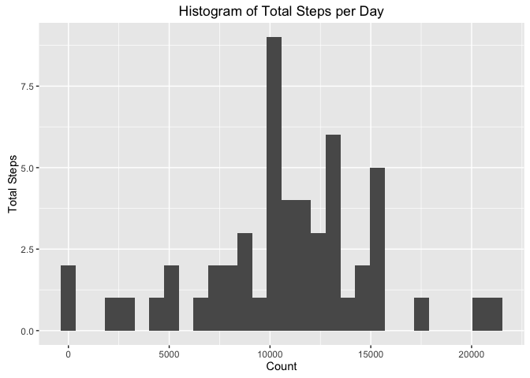
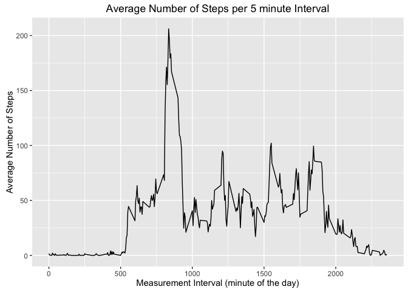
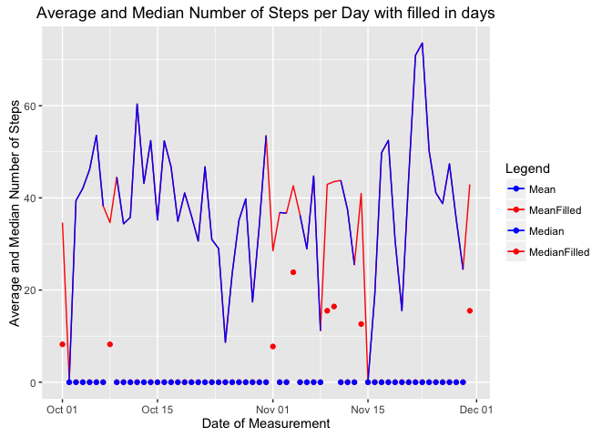
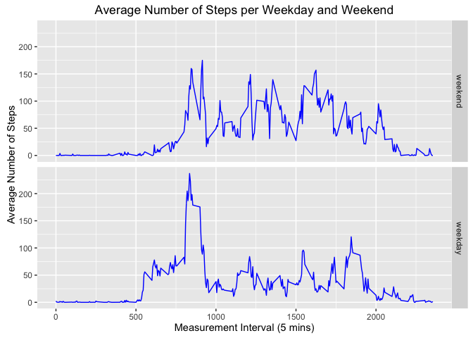

# Reproducible Research: Peer Assessment 1


## Loading and preprocessing the data

### Requirement 1
> Load the data (i.e. `read.csv()`)

Load and attach required packages

```r
library(readr)     # for reading in the zipped CSV data
library(ggplot2)   # for plotting
library(dplyr)     # for processing data (aggregating, filtering etc)
```

```
## 
## Attaching package: 'dplyr'
```

```
## The following objects are masked from 'package:stats':
## 
##     filter, lag
```

```
## The following objects are masked from 'package:base':
## 
##     intersect, setdiff, setequal, union
```

```r
library(tidyr)     # for tidying and shaping data (spread)
library(knitr)     # for using kable to generate tables
```

Load the zipped CSV data (using `readr::read_csv`) into a data set (`tibble`) called activity.

```r
activity <- read_csv("activity.zip")
```

```
## Parsed with column specification:
## cols(
##   steps = col_integer(),
##   date = col_date(format = ""),
##   interval = col_integer()
## )
```

### Requirement 2
> Process/transform the data (if necessary) into a format suitable for your analysis

Take a quick look at the data and its structure

```r
summary(activity)
```

```
##      steps             date               interval     
##  Min.   :  0.00   Min.   :2012-10-01   Min.   :   0.0  
##  1st Qu.:  0.00   1st Qu.:2012-10-16   1st Qu.: 588.8  
##  Median :  0.00   Median :2012-10-31   Median :1177.5  
##  Mean   : 37.38   Mean   :2012-10-31   Mean   :1177.5  
##  3rd Qu.: 12.00   3rd Qu.:2012-11-15   3rd Qu.:1766.2  
##  Max.   :806.00   Max.   :2012-11-30   Max.   :2355.0  
##  NA's   :2304
```

```r
str(activity)
```

```
## Classes 'tbl_df', 'tbl' and 'data.frame':	17568 obs. of  3 variables:
##  $ steps   : int  NA NA NA NA NA NA NA NA NA NA ...
##  $ date    : Date, format: "2012-10-01" "2012-10-01" ...
##  $ interval: int  0 5 10 15 20 25 30 35 40 45 ...
##  - attr(*, "spec")=List of 2
##   ..$ cols   :List of 3
##   .. ..$ steps   : list()
##   .. .. ..- attr(*, "class")= chr  "collector_integer" "collector"
##   .. ..$ date    :List of 1
##   .. .. ..$ format: chr ""
##   .. .. ..- attr(*, "class")= chr  "collector_date" "collector"
##   .. ..$ interval: list()
##   .. .. ..- attr(*, "class")= chr  "collector_integer" "collector"
##   ..$ default: list()
##   .. ..- attr(*, "class")= chr  "collector_guess" "collector"
##   ..- attr(*, "class")= chr "col_spec"
```

Therefore, no further processing is required since `readr::read_csv()` correctly detects the variable data types.


## What is mean total number of steps taken per day?

### Requirement 1
> Make a histogram of the **total** number of steps taken each day

Note that we want a *histogram* not a bar chart.

Create a data set with the total number of steps per day.

```r
steps_per_day <- activity %>% group_by(date) %>% summarise(step_sum = sum(steps)) %>% select(step_sum)

ggplot(steps_per_day, aes(x = step_sum)) +
    geom_histogram(bins=30) +
    labs(x = "Count", y = "Total Steps") +      # set label text
    ggtitle("Histogram of Total Steps per Day") # set title
```

```
## Warning: Removed 8 rows containing non-finite values (stat_bin).
```

<!-- -->

### Requirement 2
> Calculate and report the **mean** and **median** total number of steps taken per day

Create a data set containing the result of taking the mean and median aggregated by day.
Note that missing values are removed when calculating the mean and median (as per assignment instructions).


```r
activity_by_day <- activity %>%
                       group_by(date) %>%
                       summarise(step_mean   =   mean(steps, na.rm = TRUE),
                                 step_median = median(steps, na.rm = TRUE))
```

Print the mean and median per day in a table.

```r
kable(activity_by_day,
      caption   = "Mean and median steps per day",
      col.names = c("Date", "Mean number of steps", "Median number of steps"))
```


Table: Mean and median steps per day

Date          Mean number of steps   Median number of steps
-----------  ---------------------  -----------------------
2012-10-01                     NaN                       NA
2012-10-02               0.4375000                        0
2012-10-03              39.4166667                        0
2012-10-04              42.0694444                        0
2012-10-05              46.1597222                        0
2012-10-06              53.5416667                        0
2012-10-07              38.2465278                        0
2012-10-08                     NaN                       NA
2012-10-09              44.4826389                        0
2012-10-10              34.3750000                        0
2012-10-11              35.7777778                        0
2012-10-12              60.3541667                        0
2012-10-13              43.1458333                        0
2012-10-14              52.4236111                        0
2012-10-15              35.2048611                        0
2012-10-16              52.3750000                        0
2012-10-17              46.7083333                        0
2012-10-18              34.9166667                        0
2012-10-19              41.0729167                        0
2012-10-20              36.0937500                        0
2012-10-21              30.6284722                        0
2012-10-22              46.7361111                        0
2012-10-23              30.9652778                        0
2012-10-24              29.0104167                        0
2012-10-25               8.6527778                        0
2012-10-26              23.5347222                        0
2012-10-27              35.1354167                        0
2012-10-28              39.7847222                        0
2012-10-29              17.4236111                        0
2012-10-30              34.0937500                        0
2012-10-31              53.5208333                        0
2012-11-01                     NaN                       NA
2012-11-02              36.8055556                        0
2012-11-03              36.7048611                        0
2012-11-04                     NaN                       NA
2012-11-05              36.2465278                        0
2012-11-06              28.9375000                        0
2012-11-07              44.7326389                        0
2012-11-08              11.1770833                        0
2012-11-09                     NaN                       NA
2012-11-10                     NaN                       NA
2012-11-11              43.7777778                        0
2012-11-12              37.3784722                        0
2012-11-13              25.4722222                        0
2012-11-14                     NaN                       NA
2012-11-15               0.1423611                        0
2012-11-16              18.8923611                        0
2012-11-17              49.7881944                        0
2012-11-18              52.4652778                        0
2012-11-19              30.6979167                        0
2012-11-20              15.5277778                        0
2012-11-21              44.3993056                        0
2012-11-22              70.9270833                        0
2012-11-23              73.5902778                        0
2012-11-24              50.2708333                        0
2012-11-25              41.0902778                        0
2012-11-26              38.7569444                        0
2012-11-27              47.3819444                        0
2012-11-28              35.3576389                        0
2012-11-29              24.4687500                        0
2012-11-30                     NaN                       NA


## What is the average daily activity pattern?


### Requirement 1
> Make a time series plot of the 5-minute interval (x-axis) and the average number of steps taken,
averaged across all days (y-axis)

Create a data set containing the result of taking the mean and median aggregated by interval

```r
activity_by_interval <- activity %>%
                            group_by(interval) %>%
                            summarise(step_mean = mean(steps, na.rm = TRUE))

ggplot(activity_by_interval, aes(x = interval, y = step_mean) ) +
    geom_line() +
    labs(x = "Measurement Interval (minute of the day)",       # set label text
         y = "Average Number of Steps") +
    ggtitle("Average Number of Steps per 5 minute Interval")   # set title
```

<!-- -->

### Requirement 2
> Which 5-minute interval, on average across all the days in the dataset, contains the maximum number of steps?

For interest we can sort the previously saved data set by largest average number of steps - from largest to smallest.

```r
activity_by_interval %>% arrange(desc(step_mean))
```

```
## # A tibble: 288 × 2
##    interval step_mean
##       <int>     <dbl>
## 1       835  206.1698
## 2       840  195.9245
## 3       850  183.3962
## 4       845  179.5660
## 5       830  177.3019
## 6       820  171.1509
## 7       855  167.0189
## 8       815  157.5283
## 9       825  155.3962
## 10      900  143.4528
## # ... with 278 more rows
```

Retrieve the maximum number of average steps from the data set and exract the interval only.

```r
(interval_max <- activity_by_interval[which.max(activity_by_interval$step_mean),]$interval)
```

```
## [1] 835
```

Therefore the interval is **835**


## Imputing missing values
> Note that there are a number of days/intervals where there are missing values (coded as `NA`).
> The presence of missing days may introduce bias into some calculations or summaries of the data.

### Requirement 1
> Calculate and report the total number of missing values in the dataset (i.e. the total number of rows with NAs)

Add up the number of NAs per column.

```r
na_count <- as.data.frame(colSums(is.na(activity)))
kable(na_count, col.names = c("Number of Missing Values per Variable"), caption = "Number of NAs")
```


Table: Number of NAs

            Number of Missing Values per Variable
---------  --------------------------------------
steps                                        2304
date                                            0
interval                                        0

There are 2304 missing values for the steps variable only.


### Requirement 2
> Devise a strategy for filling in all of the missing values in the dataset.
The strategy does not need to be sophisticated.
For example, you could use the mean/median for that day, or the mean for that 5-minute interval, etc.

Firstly, which rows (dates) have missing step values?

```r
activity_na  <- activity %>%
                    filter(is.na(steps)) %>%
                    group_by(date) %>%
                    summarise(na_count = n())
kable(activity_na,
      caption   = "Days with missing step data",
      col.names = c("Date", "Number of missing intervals"))
```


Table: Days with missing step data

Date          Number of missing intervals
-----------  ----------------------------
2012-10-01                            288
2012-10-08                            288
2012-11-01                            288
2012-11-04                            288
2012-11-09                            288
2012-11-10                            288
2012-11-14                            288
2012-11-30                            288

Are these for whole days or for part days?  How many intervals are in a day:

```r
(number_of_intervals_per_day <- (60 / 5) * 24)
```

```
## [1] 288
```

So, there are 288 intervals per day.  Therefore the missing values are for 8 **complete** days.


We could use the average of *equivalent* day intervals - so that data missing for Monday is assigned the average of
all the other Mondays.


What weekdays are missing?

```r
activity_na$date %>% weekdays()
```

```
## [1] "Monday"    "Monday"    "Thursday"  "Sunday"    "Friday"    "Saturday" 
## [7] "Wednesday" "Friday"
```

Strategy:

1. Add week day name to the activty data set
2. Create a data set for the average number of steps for each week day for all intervals
3. For each missing day, fill with data from the data set in step 2 based on the day name.


1 - Add a weekday to activity data set

```r
activity$weekday <- weekdays(activity$date)
```

2 - Create a data set `activity_weekday_mean` to hold the average steps per interval for each week day.
Note that the days which have missing data are excluded in the mean() calculation

```r
activity_weekday_mean <- activity %>%
                             group_by(weekday, interval) %>%
                             summarise(step_mean = mean(steps, na.rm = TRUE)) %>%
                             select(weekday, interval, step_mean) %>%
                             spread(weekday, step_mean)

kable(head(activity_weekday_mean), caption = "Average number of steps per weekday (first few rows)")
```


Table: Average number of steps per weekday (first few rows)

 interval   Friday     Monday   Saturday     Sunday   Thursday     Tuesday   Wednesday
---------  -------  ---------  ---------  ---------  ---------  ----------  ----------
        0        0   1.428571          0   0.000000      5.875   0.0000000       4.250
        5        0   0.000000          0   0.000000      0.000   0.0000000       2.250
       10        0   0.000000          0   0.000000      0.000   0.0000000       0.875
       15        0   0.000000          0   0.000000      1.000   0.0000000       0.000
       20        0   0.000000          0   0.000000      0.000   0.4444444       0.000
       25        0   5.000000          0   7.428571      1.375   1.4444444       0.000

3 - Now create a function to fill in the missing dates based on their week day name
(Monday in `activity` is filled in with `Monday` from `activity_weekday_mean`.

This function will
* take a date for a day which is missing step data and
* return a data set containing the average steps for each interval for the date's week day.


```r
fill_missing_values <- function(date_missing) {

    # Create a temporary data set for the date that is missing step data and
    # populate it by extracting the mean step values for the missing day
    fill_df  <- cbind(date_missing,
                      activity_weekday_mean[c( weekdays(date_missing), "interval" )])

    # Assign proper column names to the temporary data set and...
    names(fill_df) <- c("date", "steps", "interval")

    # ...select those columns in the correct order
    fill_df %>% select(steps, date, interval)
}
```


### Requirement 3
> Create a new dataset that is equal to the original dataset but with the missing data filled in.

New tibble with filled in values

```r
activity_na_dates  <- as.tbl( lapply(activity_na$date, fill_missing_values) %>% do.call(rbind, .) )
kable(head(activity_na_dates), caption = "Data set of steps per interval for missing dates (first few rows)")
```


Table: Data set of steps per interval for missing dates (first few rows)

    steps  date          interval
---------  -----------  ---------
 1.428571  2012-10-01           0
 0.000000  2012-10-01           5
 0.000000  2012-10-01          10
 0.000000  2012-10-01          15
 0.000000  2012-10-01          20
 5.000000  2012-10-01          25

Strip out NA days from original data set and drop weekday variable

```r
activity_na_rm <- activity %>% filter(!is.na(steps)) %>% select(-weekday)
kable(head(activity_na_rm), caption = "Data set of activities without days which have missing dates (first few rows)")
```


Table: Data set of activities without days which have missing dates (first few rows)

 steps  date          interval
------  -----------  ---------
     0  2012-10-02           0
     0  2012-10-02           5
     0  2012-10-02          10
     0  2012-10-02          15
     0  2012-10-02          20
     0  2012-10-02          25

This is the rbind of the data sets above, call arrange() to sort by date and interval as per the original data set

```r
activity_filled <- rbind(activity_na_rm, activity_na_dates) %>% arrange(date, interval)
kable(head(activity_filled), caption = "Original data set with missing data filled in (first few rows)")
```


Table: Original data set with missing data filled in (first few rows)

    steps  date          interval
---------  -----------  ---------
 1.428571  2012-10-01           0
 0.000000  2012-10-01           5
 0.000000  2012-10-01          10
 0.000000  2012-10-01          15
 0.000000  2012-10-01          20
 5.000000  2012-10-01          25


### Requirement 4a
> Make a histogram of the total number of steps taken each day


```r
steps_per_day <- activity_filled %>% group_by(date) %>% summarise(step_sum = sum(steps)) %>% select(step_sum)

ggplot(steps_per_day, aes(x = step_sum)) +
    geom_histogram(bins=30) +
    labs(x = "Count", y = "Total Steps") +      # set label text
    ggtitle("Histogram of Total Steps per Day for Filled In Data") # set title
```

<!-- -->

The graph is noticably different between 7000 and 16000.

### Requirement 4b
> Calculate and report the **mean** and **median** total number of steps taken per day.


```r
activity_filled_by_day <- activity_filled %>%
                              group_by(date) %>%
                              summarise(step_mean   = mean(steps),
                                        step_median = median(steps))
```

Print the mean and median per day in a table.

```r
kable(activity_filled_by_day,
      caption   = "Filled in Mean and median steps per day",
      col.names = c("Date", "Mean number of steps", "Median number of steps"))
```


Table: Filled in Mean and median steps per day

Date          Mean number of steps   Median number of steps
-----------  ---------------------  -----------------------
2012-10-01              34.6349206                 8.214286
2012-10-02               0.4375000                 0.000000
2012-10-03              39.4166667                 0.000000
2012-10-04              42.0694444                 0.000000
2012-10-05              46.1597222                 0.000000
2012-10-06              53.5416667                 0.000000
2012-10-07              38.2465278                 0.000000
2012-10-08              34.6349206                 8.214286
2012-10-09              44.4826389                 0.000000
2012-10-10              34.3750000                 0.000000
2012-10-11              35.7777778                 0.000000
2012-10-12              60.3541667                 0.000000
2012-10-13              43.1458333                 0.000000
2012-10-14              52.4236111                 0.000000
2012-10-15              35.2048611                 0.000000
2012-10-16              52.3750000                 0.000000
2012-10-17              46.7083333                 0.000000
2012-10-18              34.9166667                 0.000000
2012-10-19              41.0729167                 0.000000
2012-10-20              36.0937500                 0.000000
2012-10-21              30.6284722                 0.000000
2012-10-22              46.7361111                 0.000000
2012-10-23              30.9652778                 0.000000
2012-10-24              29.0104167                 0.000000
2012-10-25               8.6527778                 0.000000
2012-10-26              23.5347222                 0.000000
2012-10-27              35.1354167                 0.000000
2012-10-28              39.7847222                 0.000000
2012-10-29              17.4236111                 0.000000
2012-10-30              34.0937500                 0.000000
2012-10-31              53.5208333                 0.000000
2012-11-01              28.5164931                 7.750000
2012-11-02              36.8055556                 0.000000
2012-11-03              36.7048611                 0.000000
2012-11-04              42.6309524                23.857143
2012-11-05              36.2465278                 0.000000
2012-11-06              28.9375000                 0.000000
2012-11-07              44.7326389                 0.000000
2012-11-08              11.1770833                 0.000000
2012-11-09              42.9156746                15.500000
2012-11-10              43.5257937                16.428571
2012-11-11              43.7777778                 0.000000
2012-11-12              37.3784722                 0.000000
2012-11-13              25.4722222                 0.000000
2012-11-14              40.9401042                12.625000
2012-11-15               0.1423611                 0.000000
2012-11-16              18.8923611                 0.000000
2012-11-17              49.7881944                 0.000000
2012-11-18              52.4652778                 0.000000
2012-11-19              30.6979167                 0.000000
2012-11-20              15.5277778                 0.000000
2012-11-21              44.3993056                 0.000000
2012-11-22              70.9270833                 0.000000
2012-11-23              73.5902778                 0.000000
2012-11-24              50.2708333                 0.000000
2012-11-25              41.0902778                 0.000000
2012-11-26              38.7569444                 0.000000
2012-11-27              47.3819444                 0.000000
2012-11-28              35.3576389                 0.000000
2012-11-29              24.4687500                 0.000000
2012-11-30              42.9156746                15.500000

> Do these values differ from the estimates from the first part of the assignment?

Yes, we now have non-zero values for the median and values for the mean for missing days.


Plotting these two data setes shows the impact of the filled in days.  Red lines and points are the filled in values.


```r
# Create mappings for the colours so that we get a meaningful legend
colname_colors <- c("MeanFilled"   = "red",
                    "MedianFilled" = "red",
                    "Mean"         = "blue",
                    "Median"       = "blue")

ggplot(activity_filled_by_day,  aes(x = date, y = step_mean)) +
    geom_line( aes(y = step_mean,   color = "MeanFilled")) +
    geom_point(aes(y = step_median, color = "MedianFilled")) +
    geom_line( data = activity_by_day, aes(x = date, y = step_mean,   color = "Mean")) +
    geom_point(data = activity_by_day, aes(          y = step_median, color = "Median")) +
    scale_colour_manual("Legend", values = colname_colors) +
    labs(x = "Date of Measurement",
         y = "Average and Median Number of Steps") +        # set label text
    ggtitle("Average and Median Number of Steps per Day with filled in days")  # set title
```

<!-- -->

> What is the impact of imputing missing data on the estimates of the total daily number of steps?

The total number of daily steps is changed as follows:

Original number of total steps:

```r
(total_daily_steps_original <- sum(activity$steps, na.rm = TRUE))
```

```
## [1] 570608
```

Number of total steps for filled in missing days:

```r
(total_daily_steps <- sum(activity_filled$steps))
```

```
## [1] 660093.8
```

Difference between the two is:

```r
(steps_added <- total_daily_steps - total_daily_steps_original)
```

```
## [1] 89485.79
```

By imputing missing values, we have added 89485.79 steps to the total.


## Are there differences in activity patterns between weekdays and weekends?

### Requirement 1
> Create a new factor variable in the dataset with two levels -- "weekday" and "weekend" indicating
whether a given date is a weekday or weekend day.

This function translates a week day name for a date into a label indicating whether it is a "weekday" or "weekend".

```r
week_day_type <- function(date) {
    ifelse(weekdays(date) %in% c("Saturday", "Sunday"), "weekend", "weekday")
}
```

Set the factor levels so that weekend plot is above weekday plot in part 2 below

```r
activity_filled$week_day_type <- factor(week_day_type(activity_filled$date),
                                        levels = c("weekend", "weekday"))
kable(head(activity_filled))
```

    steps  date          interval  week_day_type 
---------  -----------  ---------  --------------
 1.428571  2012-10-01           0  weekday       
 0.000000  2012-10-01           5  weekday       
 0.000000  2012-10-01          10  weekday       
 0.000000  2012-10-01          15  weekday       
 0.000000  2012-10-01          20  weekday       
 5.000000  2012-10-01          25  weekday       

### Requirement 2
> Make a panel plot containing a time series plot (i.e. `type = "l"`) of the 5-minute interval (x-axis)
and the average number of steps taken, averaged across all weekday days or weekend days (y-axis).


Calculate the average steps per week day type (weekday or weekend)

```r
activity_filled_by_interval <- activity_filled %>%
                                   group_by(week_day_type, interval) %>%
                                   summarise(step_mean = mean(steps))
```

Plot results

```r
ggplot(activity_filled_by_interval, aes(x = interval, y = step_mean), color = "blue" ) +
        geom_line(color="blue") +
        facet_grid(week_day_type ~ .) +
        labs(x = "Measurement Interval (5 mins)", y = "Average Number of Steps") +
        ggtitle("Average Number of Steps per Weekday and Weekend")
```

<!-- -->

## Notes

1. The MD and HTML documents were generated using `rmarkdown::render()` since `knitr::knit2html()` gives the following error:

```
knitr::knit2html("PA1_template.Rmd")
Error: It seems you should call rmarkdown::render() instead of knitr::knit2html() because PA1_template.Rmd appears to be an R Markdown v2 document.
```

2. Figures are stored in `PA1_template_files/figure-html/`

3. See RStudio note [here](http://rmarkdown.rstudio.com/authoring_migrating_from_v1.html)


```r
sessionInfo()
```

```
## R version 3.3.2 (2016-10-31)
## Platform: x86_64-apple-darwin16.1.0 (64-bit)
## Running under: macOS Sierra 10.12.4
## 
## locale:
## [1] en_NZ.UTF-8/en_NZ.UTF-8/en_NZ.UTF-8/C/en_NZ.UTF-8/en_NZ.UTF-8
## 
## attached base packages:
## [1] stats     graphics  grDevices utils     datasets  methods   base     
## 
## other attached packages:
## [1] knitr_1.15.1  tidyr_0.6.0   dplyr_0.5.0   ggplot2_2.1.0 readr_1.0.0  
## [6] rmarkdown_1.4
## 
## loaded via a namespace (and not attached):
##  [1] Rcpp_0.12.7      magrittr_1.5     munsell_0.4.3    colorspace_1.2-7
##  [5] R6_2.2.0         highr_0.6        stringr_1.1.0    plyr_1.8.4      
##  [9] tools_3.3.2      grid_3.3.2       gtable_0.2.0     DBI_0.5-1       
## [13] htmltools_0.3.5  yaml_2.1.13      lazyeval_0.2.0   assertthat_0.1  
## [17] rprojroot_1.2    digest_0.6.10    tibble_1.2       reshape2_1.4.1  
## [21] evaluate_0.10    labeling_0.3     stringi_1.1.2    scales_0.4.0    
## [25] backports_1.0.5
```
